# e-commerce

Beauté is an e-commerce website that sells different beauty products targeting both male and female audience. Users of the website are able to buy and also sell their own products in the site. 

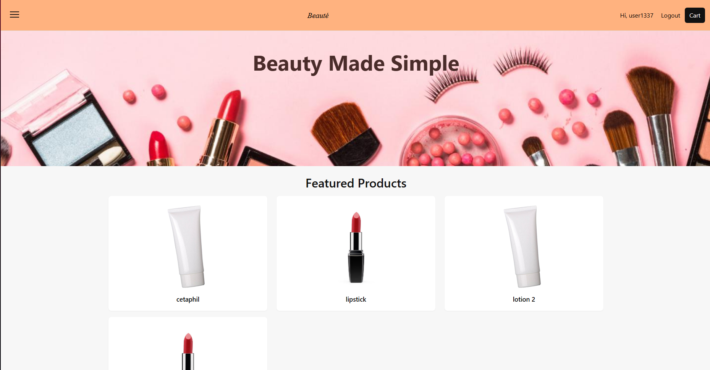

## Features

The project has a title that give the audience the context as of the website. 

Underneath is a photo of the homepage of the website. It showcases the available products that can be bought on the website. 

### Existing Features 

- __Heading__

- Featured at the top of the page is the navigation bar which has different features.
- On the upper left is a Hamburger menu that has buttons for going to the Homepage, Shop and About Us.
- On the upper right is the Login button initially. After logging it, It has been replaced with the Profile, Logout button, and the Cart button.

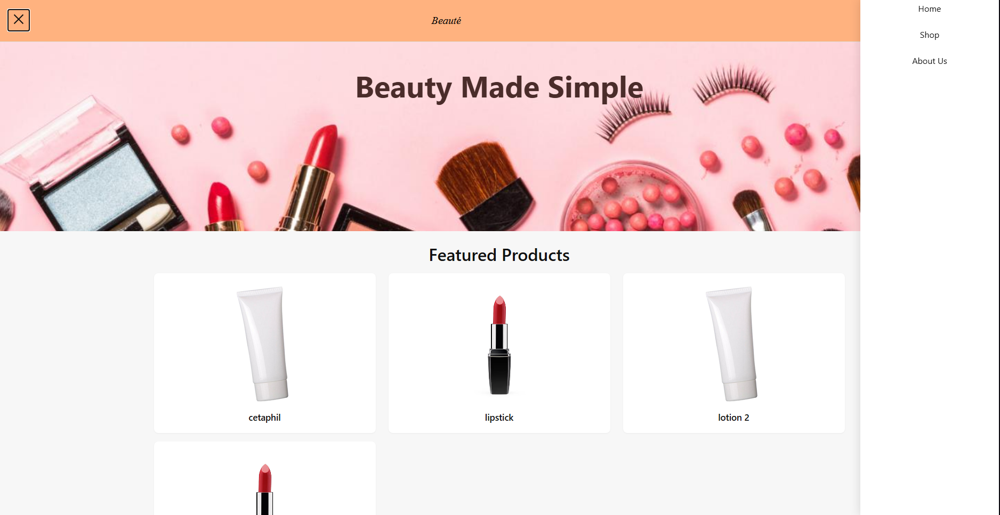

- __LoginPage__

- A Login/Sign in page for users to login to their accounts.
- requires a username and password to login. 
- Also has a sign up button for users who want to create an account.

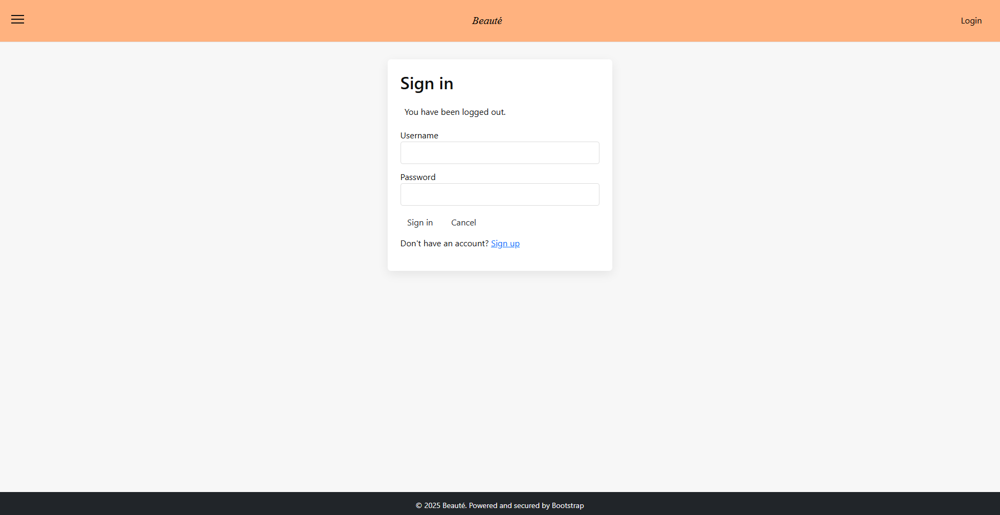

- __SignUpPage__

- A Sign up Page that requires users to input their credentials.
- Username and Password have requirements to further secure their account.

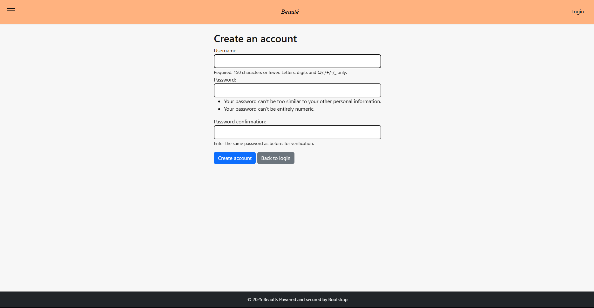 

- __ShopPage__

- A page where users can buy or sell their products.
- By pressing the Add to cart button, places the item into your cart.

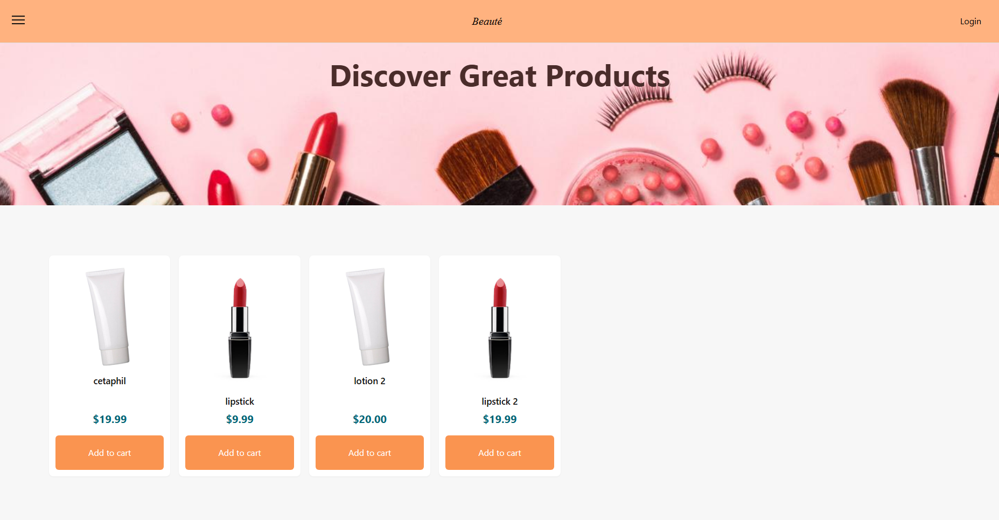

- __EditProfilePage__

- A page where users can edit the details of their accounts.
- This is also where users can sell their items on the website.
- Selling an item requires a Name and a Price.
- Adding an image is not required but is encouraged.

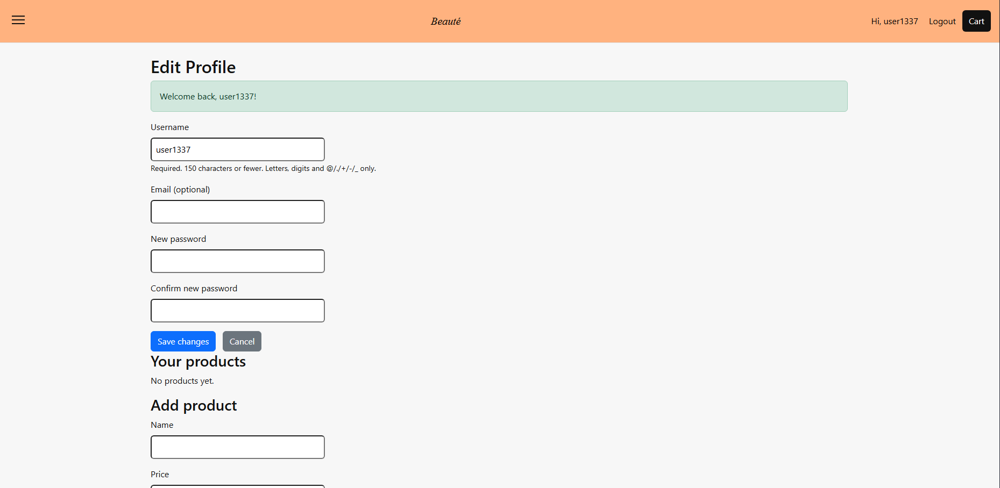

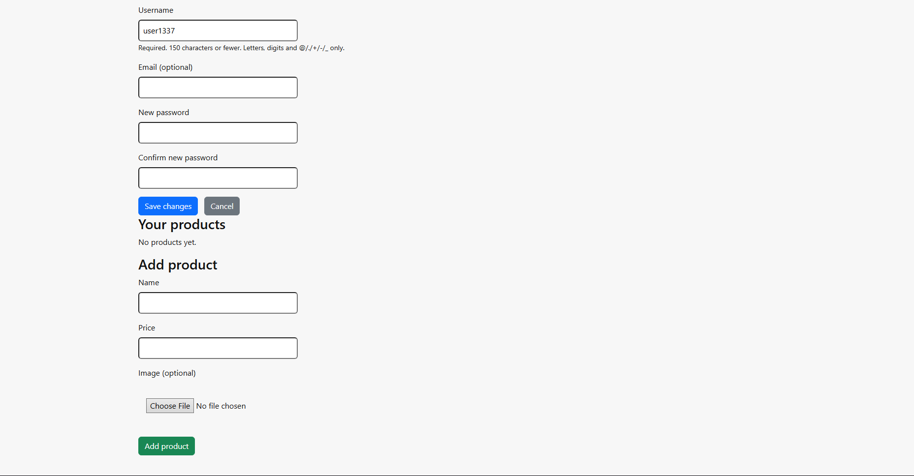
 
- __CheckoutPage__

- A page where you input your credentials for delivery.
- It displays everything in your cart and the total amount.

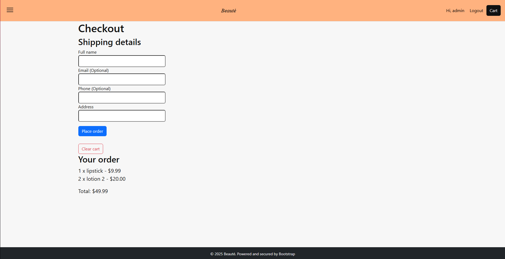

- __CheckoutSuccess__

- After checking out, will display that the order has been received.
- Displays your order id, your credentials and the item that you have purchased

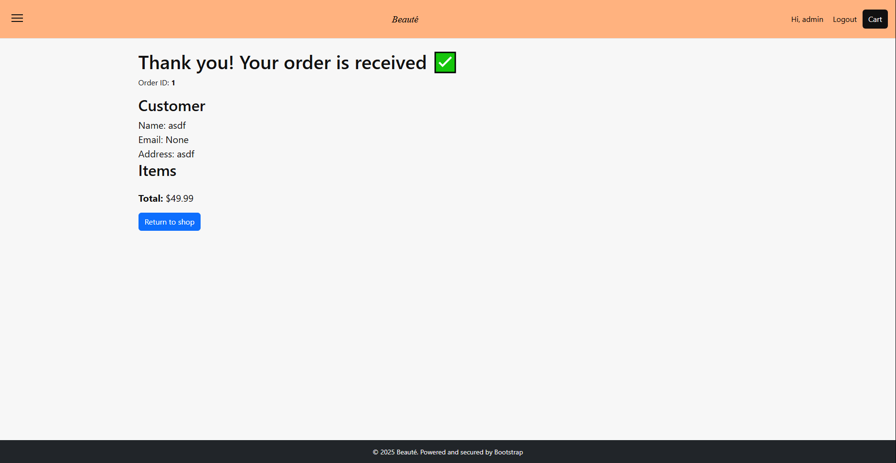

- __404__

- A 404 page in case a user would be accessing something that is unavailable or non-existant.

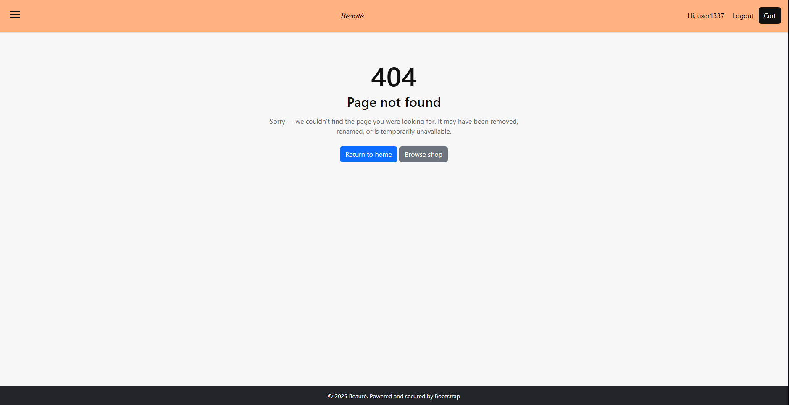

## Testing

The website has been tested on different devices such as phone, desktop and notebooks.
The sizes adjust as per device.

### Validator Testing

- HTML
  - No errors were returned when passing through the official [W3C_validator]
 
  - Index
  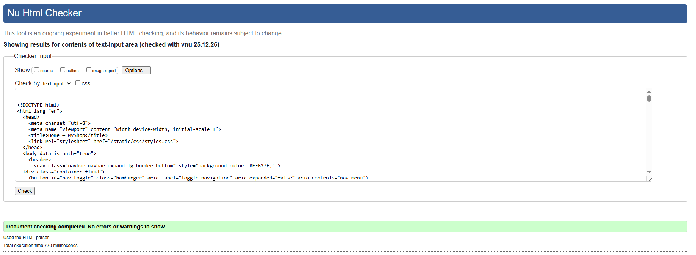

  - Login/Sign in
  

  - Signup
  

  - Shop
  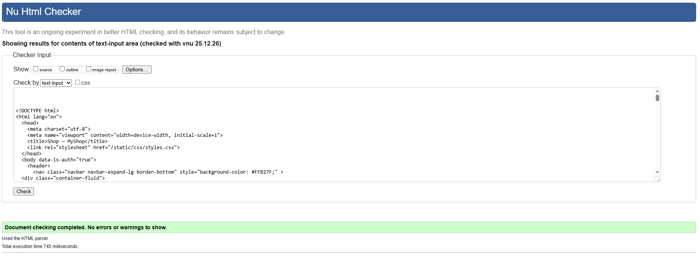

  - Edit Profile
  

  - Checkout 
  

  - Checkout Success
  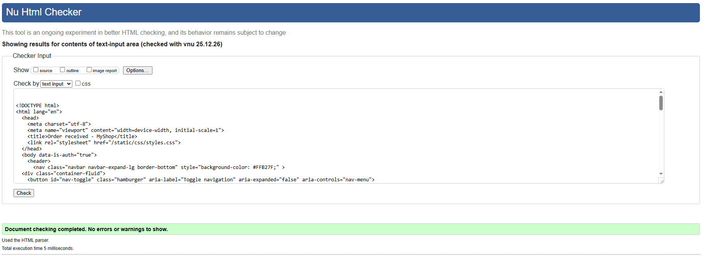

- CSS
  - No errors were returned when passing through the official [(Jigsaw)_validator](static/img/READ-ME-IMG/css_validator.png)
 
- JavaScript 
  - No errors were found when passing through the official [Jslint_validator](static/img/READ-ME-IMG/js_validator.png)

## Deployment

- The site was deployed to Railway.
  - In Railway, navigate to the Dashboard.
  - Click on New and Github Repository.
  - Connect your Github then deploy your website and your database. 

The live link can be found here: https://e-commerce-production-e89d.up.railway.app

## Database 

- The Database consists of 4 Tables.
  - (1) auth_user, (2) user_products, (3) user_cart, (4) user_orders

- Every table having their own ID as the primary key.
- Below is an image that shows the structure of the database. 

## Credits 

These are the ff links used for media int the website: 
- https://i.ebayimg.com/images/g/S0sAAOSwBQ9hsYBU/s-l1200.jpg
- https://media.istockphoto.com/id/164505409/photo/red-lipstick.jpg?s=612x612&w=0&k=20&c=dnZ2e8AC3qH8FVStYzo-3MuU1XIXk-8xy63Hm-DhXbg=
- https://cciphilippinesinc.com/02-1-about-ccip/images/18cf4234b8e70e971816e21754249841.jpg

### Content 
- The text for the Index was generated by the author.
- Instructions on how to create a hamburger menu was from W3Schools

### Media 
- The photos used on the home and sign up page are from This Open Source site
- The images used for the gallery page were taken from online sites which are all enumerated int the credits sexction.

